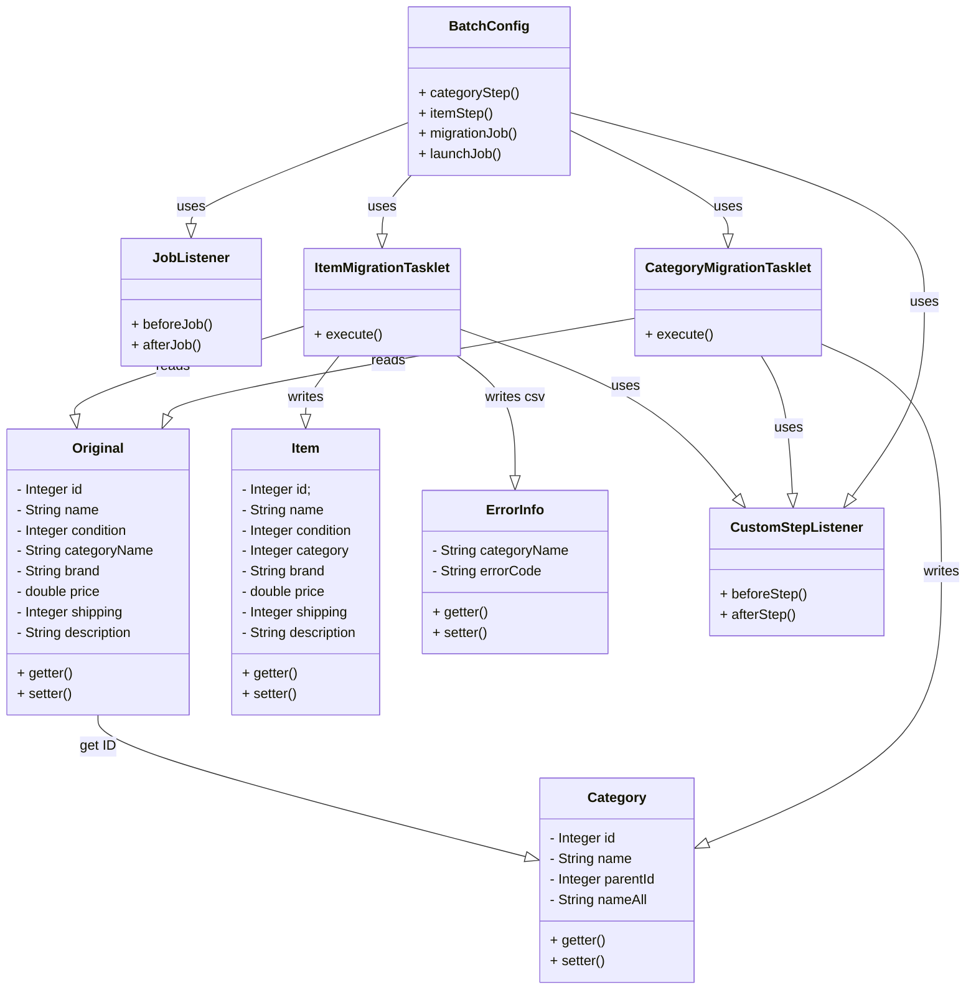

```mermaid
classDiagram
   
    class Original {
        - Integer id
        - String name
        - Integer condition
        - String categoryName
        - String brand
        - double price
        - Integer shipping
        - String description
        + getter()
        + setter()

    }
    class Category {
        - Integer id
        - String name
        - Integer parentId
        - String nameAll
        + getter()
        + setter()
    }
    class Item {
        - Integer id;
        - String name
        - Integer condition
        - Integer category
        - String brand
        - double price
        - Integer shipping
        - String description
        + getter()
        + setter()
    }
    class ErrorInfo {
        - String categoryName
        - String errorCode
        + getter()
        + setter()
    }
    class CustomStepListener {
        + beforeStep()
        + afterStep()
    }
    class JobListener {
        + beforeJob()
        + afterJob()
    }
    class CategoryMigrationTasklet {
        + execute()
    }
    class ItemMigrationTasklet {
        + execute()

    }
    class BatchConfig {
        + categoryStep()
        + itemStep()
        + migrationJob()
        + launchJob()
    }

    BatchConfig --|> CategoryMigrationTasklet : uses
    BatchConfig --|> ItemMigrationTasklet : uses
    BatchConfig --|> CustomStepListener : uses
    BatchConfig --|> JobListener : uses
    

    CategoryMigrationTasklet --|> CustomStepListener : uses
    CategoryMigrationTasklet --|> Original : reads
    CategoryMigrationTasklet --|> Category : writes

    ItemMigrationTasklet --|> CustomStepListener : uses
    ItemMigrationTasklet --|> Original : reads
    ItemMigrationTasklet --|> Item : writes
    ItemMigrationTasklet --|> ErrorInfo : writes csv
    Original --|> Category : get ID
```
