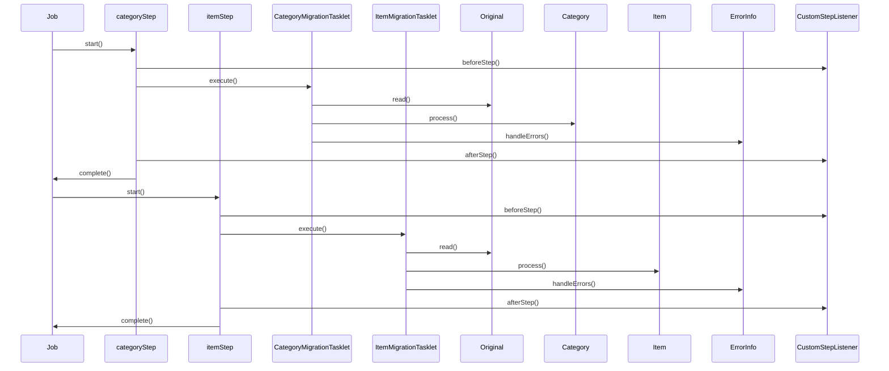

```mermaid
sequenceDiagram
    participant Job as Job
    participant Step1 as categoryStep
    participant Step2 as itemStep
    participant CategoryMigrationTasklet as CategoryMigrationTasklet
    participant ItemMigrationTasklet as ItemMigrationTasklet
    participant Original as Original
    participant Category as Category
    participant Item as Item
    participant ErrorInfo as ErrorInfo
    participant CustomStepListener as CustomStepListener

    Job ->> Step1: start()
    Step1 ->> CustomStepListener: beforeStep()
    Step1 ->> CategoryMigrationTasklet: execute()
    CategoryMigrationTasklet ->> Original: read()
    CategoryMigrationTasklet ->> Category: process()
    CategoryMigrationTasklet ->> ErrorInfo: handleErrors()
    Step1 ->> CustomStepListener: afterStep()
    Step1 ->> Job: complete()

    Job ->> Step2: start()
    Step2 ->> CustomStepListener: beforeStep()
    Step2 ->> ItemMigrationTasklet: execute()
    ItemMigrationTasklet ->> Original: read()
    ItemMigrationTasklet ->> Item: process()
    ItemMigrationTasklet ->> ErrorInfo: handleErrors()
    Step2 ->> CustomStepListener: afterStep()
    Step2 ->> Job: complete()
```
